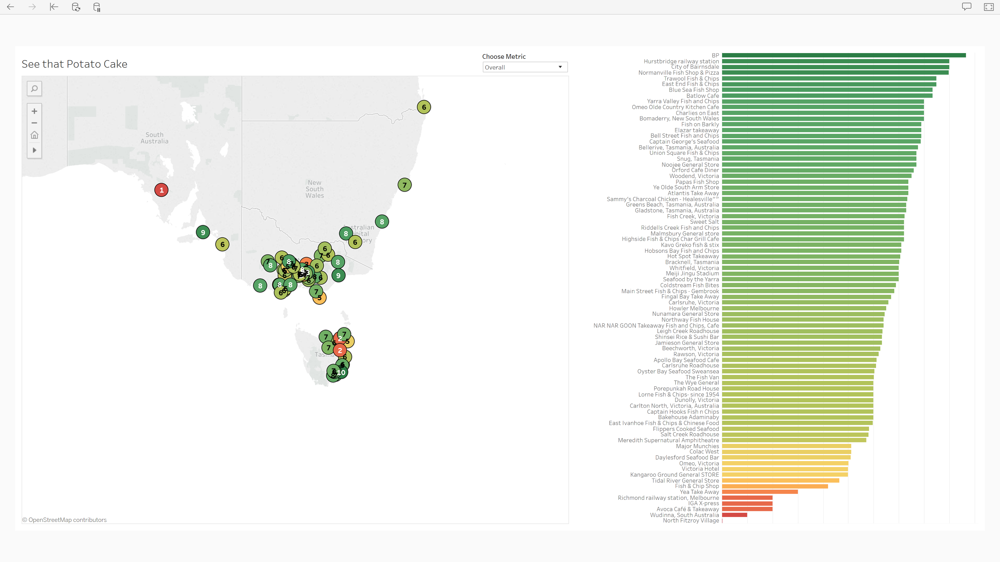

# See that PC

In January 2019 [RMIT Online](https://online.rmit.edu.au) held their first staff hackathon. I decided to spend the day searching for the best [potato cakes](https://en.wikipedia.org/wiki/Potato_cake#In_Australia,_England,_and_Scotland) in Australia!

## Potato cakes?!

If you're thinking "why potato cakes?", it's mostly because they're tasty and aren't subject to any data protection regulation (AFAIK). 

The theme for the hackathon was "the future of learning". I approached the theme _somewhat_ broadly, using the time to try my hand at some data wrangling and visualisation. I was learning something that might be helpful in _my_ future. I also hoped it would get people thinking about the types of data we had available and what they could learn to improve things across the business. 

So, where do you get the best potato cakes? Thankfully, Australia's premier potato cake rater [@ratethatpc](https://www.instagram.com/ratethatpc/) has done plenty of field research. They've diligently rated potato cakes on various properties including freshness, batter and value, as well as providing an overall rating. Most of their posts are tagged with a location or, if the potato cakery(?) doesn't have a public profile, the approximate location[^1]. In an ideal world it would be nice to have more data and multiple independent reviews, but for now I'll trust they know what they're doing and their ratings are free from bias.

## Getting the data

If you've been on the 'gram for a while, you might remember having a [photo map](https://mashable.com/2016/09/06/instagram-kills-photo-maps/). In lieu of inventing a time machine, the easiest option was to scrape all the data and recreate a map.

Rather than jump through hoops to get access to the [developer API](https://www.instagram.com/developer/) I chose to use use [Instaloader](https://instaloader.github.io/) to do some of the heavy lifting. After playing with some of the tags, I was able to download a handful of JSON files containing both the location and caption, with the ratings, e.g.:

```
"location": {
            "has_public_page": true,
            "id": 344040041,
            "lat": -37.69151,
            "lng": 145.21579,
            "name": "Kangaroo Ground General STORE",
            "slug": "kangaroo-ground-general-store"
},
```

```
"edge_media_to_caption": {
    "edges": [
        {
            "node": {
                "text": "The Kangaroo Ground General Store is perfectly positioned on a popular cycling thoroughfare to the green spaces of the outer east of Melbourne. It also offers a fantastic range niche soft drink and $2.00 overnight DVD rentals if that's your style. But their fried potato offering are.... Size: 7/10. Yeah it was fine.\nBatter: 3/10. Floppy, flaccid, soggy. \nPotato core: 4/10. Closer to mash potato than fried potato.\nPrice: 6/10. $1.00 each but only 4 given when 4 ordered. \nConsistency: 6/10. Slight and appropriate variation between each, but all equally disappointing. \nFreshness: 3/10. I'm guessing it was put in the deep fryer before going into the bain-marie, but I couldn't tell how many hours or days earlier that occured. \nOverall: 5/10. Stick to the wide variety of DVDs and niche soft drinks on offer."
            }
        }
    ]
}
```

## Putting it all together

Pulling the right fields out of each file required a few lines of Python. Crafting a regular expression to find ratings for each category took a little longer. The end result was bundled back up into a nice, clean JSON file with the ratings, latitude, longitude and name of the vendor. 

Originally I was going to throw this onto Mapbox, but it ended up being quicker to drop the data into our Tableau environment. With a bit of help from our knowledge team, it was up and running pretty quickly:



## Wrapping up

It was fun to spend a couple of days wrangling Python and experimenting with different options in Tableau. My final presentation got a lot of laughs and (I think) a few people got the idea behind it. A potato cake emoji was added to the company Slack channel and a few days later we went on to test the accuracy of the ratings. A group taste-test from the closest vendor (Richmond railway station) validated their ranking, a deserved 5th from bottom! 

At some point I'd like to revisit this to fix a few bugs, automate updating the data source and publish the map. I might even branch out to other types of [fried potato](https://www.instagram.com/mips_chips/). 

## Running the code

If you want to try this out yourself, you'll need to have both Python 3 and [Instaloader](https://instaloader.github.io/) installed. The instructions below worked in 2019, I expect Instagram/Instaloader will have changed by now:

1. Clone this repo and `cd` into it
2. Scrape the RTPC account `instaloader --login=YOUR_USERNAME --no-pictures --no-compress-json --no-captions --geotags ratethatpc`
3. Wrangling the output: `python3 stpc.py`
4. Load the resulting file (`result.json`) file into your data visualisation platform of choice!

[^1]: Australia is big but it's towns are small. It shouldn't be too hard to find the right spot in the wild so I just used either type of location interchangeably.
